## Laboratorio #4 – REST API Blueprints (Java 21 / Spring Boot 3.3.x)
# Escuela Colombiana de Ingeniería – Arquitecturas de Software  

---

## 📋 Requisitos
- Java 21
- Maven 3.9+

## ▶️ Ejecución del proyecto
```bash
mvn clean install
mvn spring-boot:run
```
Probar con `curl`:
```bash
curl -s http://localhost:8080/blueprints | jq
curl -s http://localhost:8080/blueprints/john | jq
curl -s http://localhost:8080/blueprints/john/house | jq
curl -i -X POST http://localhost:8080/blueprints -H 'Content-Type: application/json' -d '{ "author":"john","name":"kitchen","points":[{"x":1,"y":1},{"x":2,"y":2}] }'
curl -i -X PUT  http://localhost:8080/blueprints/john/kitchen/points -H 'Content-Type: application/json' -d '{ "x":3,"y":3 }'
```

> Si deseas activar filtros de puntos (reducción de redundancia, *undersampling*, etc.), implementa nuevas clases que implementen `BlueprintsFilter` y cámbialas por `IdentityFilter` con `@Primary` o usando configuración de Spring.
---

Abrir en navegador:  
- Swagger UI: [http://localhost:8080/swagger-ui.html](http://localhost:8080/swagger-ui.html)  
- OpenAPI JSON: [http://localhost:8080/v3/api-docs](http://localhost:8080/v3/api-docs)  

---

## 🗂️ Estructura de carpetas (arquitectura)

```
src/main/java/edu/eci/arsw/blueprints
  ├── model/         # Entidades de dominio: Blueprint, Point
  ├── persistence/   # Interfaz + repositorios (InMemory, Postgres)
  │    └── impl/     # Implementaciones concretas
  ├── services/      # Lógica de negocio y orquestación
  ├── filters/       # Filtros de procesamiento (Identity, Redundancy, Undersampling)
  ├── controllers/   # REST Controllers (BlueprintsAPIController)
  └── config/        # Configuración (Swagger/OpenAPI, etc.)
```

> Esta separación sigue el patrón **capas lógicas** (modelo, persistencia, servicios, controladores), facilitando la extensión hacia nuevas tecnologías o fuentes de datos.

---

## 📖 Actividades del laboratorio

### 1. Familiarización con el código base
- Revisa el paquete `model` con las clases `Blueprint` y `Point`.  
- Entiende la capa `persistence` con `InMemoryBlueprintPersistence`.  
- Analiza la capa `services` (`BlueprintsServices`) y el controlador `BlueprintsAPIController`.

### 2. Migración a persistencia en PostgreSQL
- Configura una base de datos PostgreSQL (puedes usar Docker).  
- Implementa un nuevo repositorio `PostgresBlueprintPersistence` que reemplace la versión en memoria.  
- Mantén el contrato de la interfaz `BlueprintPersistence`.  

### 3. Buenas prácticas de API REST
- Cambia el path base de los controladores a `/api/v1/blueprints`.  
- Usa **códigos HTTP** correctos:  
  - `200 OK` (consultas exitosas).  
  - `201 Created` (creación).  
  - `202 Accepted` (actualizaciones).  
  - `400 Bad Request` (datos inválidos).  
  - `404 Not Found` (recurso inexistente).  
- Implementa una clase genérica de respuesta uniforme:
  ```java
  public record ApiResponse<T>(int code, String message, T data) {}
  ```
  Ejemplo JSON:
  ```json
  {
    "code": 200,
    "message": "execute ok",
    "data": { "author": "john", "name": "house", "points": [...] }
  }
  ```

Se actualizó el controlador `BlueprintsAPIController` aplicando las siguientes mejoras:

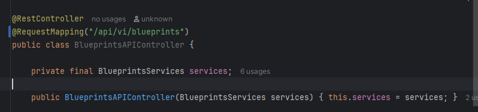

- **Versionamiento de la API**: se cambió el path base de `/blueprints` a `/api/v1/blueprints`, siguiendo la convención de versionar los endpoints desde la URL.

- **Respuesta uniforme con `ApiResponse<T>`**: se creó un record genérico en el paquete `dto` que envuelve todas las respuestas del API con un código, un mensaje y los datos:

```java
  public record ApiResponse<T>(int code, String message, T data) {}
```

Esto aplica tanto para respuestas exitosas como para errores, manteniendo un formato consistente en todo el API.

- **Códigos HTTP correctos**: cada endpoint retorna el código apropiado según el resultado de la operación:
    - `200 OK` en las consultas (`GET`).
    - `201 Created` al crear un blueprint nuevo.
    - `202 Accepted` al actualizar un blueprint existente (agregar un punto).
    - `400 Bad Request` cuando la creación falla por datos inválidos o conflicto de persistencia.
    - `404 Not Found` cuando el autor o el blueprint solicitado no existe.

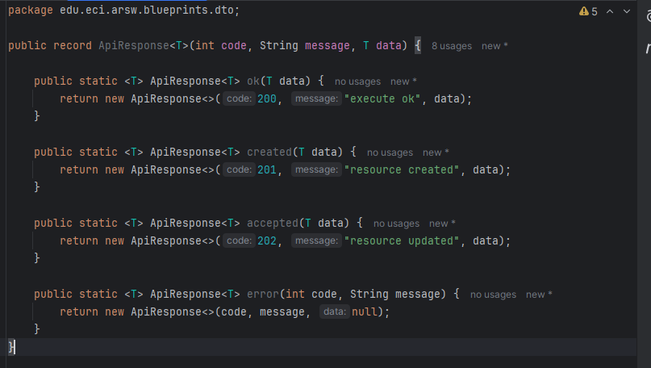

###### Manejo de excepciones

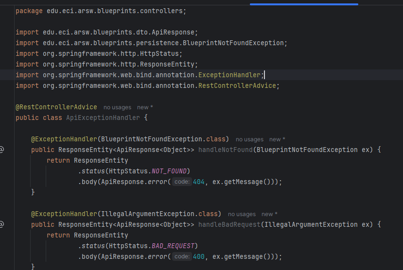

### 4. OpenAPI / Swagger
- Configura `springdoc-openapi` en el proyecto.  
- Expón documentación automática en `/swagger-ui.html`.  
- Anota endpoints con `@Operation` y `@ApiResponse`.


Verificación de swagger

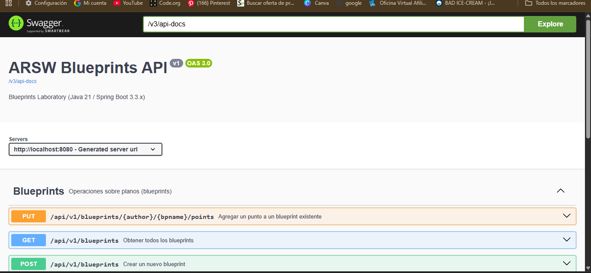

Se observan los 5 endpoints agrupados bajo el tag "Blueprints", con la ruta versionada `/api/v1/blueprints` y una descripción corta de cada operación.

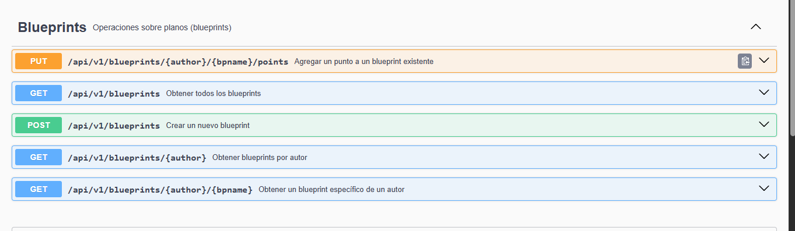

### 5. Filtros de *Blueprints*
- Implementa filtros:
  - **RedundancyFilter**: elimina puntos duplicados consecutivos.  
  - **UndersamplingFilter**: conserva 1 de cada 2 puntos.  
- Activa los filtros mediante perfiles de Spring (`redundancy`, `undersampling`).  

---

## ✅ Entregables

1. Repositorio en GitHub con:  
   - Código fuente actualizado.  
   - Configuración PostgreSQL (`application.yml` o script SQL).  
   - Swagger/OpenAPI habilitado.  
   - Clase `ApiResponse<T>` implementada.  

2. Documentación:  
   - Informe de laboratorio con instrucciones claras.  
   - Evidencia de consultas en Swagger UI y evidencia de mensajes en la base de datos.  
   - Breve explicación de buenas prácticas aplicadas.  

---

## Evidencias

1. punto 1


2. Punto 2 Migracion a postgres

La migracion a posgres se realizo usando una estructura de persistencia relacional dividida en 3 paquetes:

- Entity: clases que mapean el dominio a tablas con JPA (BlueprintEntity → tabla blueprints, PointEmbeddable → tabla blueprint_points).

- Mapper: convierte entre las entidades JPA y el modelo de dominio (Blueprint, Point), para que el resto de la app no dependa de JPA.

- Repository: interfaz de Spring Data JPA (BlueprintJpaRepository) que genera las consultas SQL automáticamente, sin necesidad de implementarla a mano.

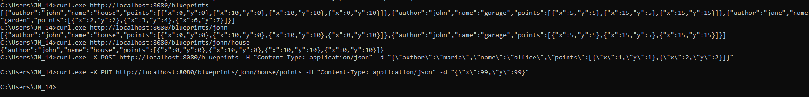

Se realizo la prueba del local host mediante los curls

- GET - listar todos los blueprints
curl.exe http://localhost:8080/blueprints

- GET - blueprints de un autor
curl.exe http://localhost:8080/blueprints/john

- GET - un blueprint específico
curl.exe http://localhost:8080/blueprints/john/house

- POST - crear un blueprint nuevo
curl.exe -X POST http://localhost:8080/blueprints -H "Content-Type: application/json" -d "{\"author\":\"maria\",\"name\":\"office\",\"points\":[{\"x\":1,\"y\":1},{\"x\":2,\"y\":2}]}"

- PUT - agregar un punto a un blueprint existente
curl.exe -X PUT http://localhost:8080/blueprints/john/house/points -H "Content-Type: application/json" -d "{\"x\":99,\"y\":99}"

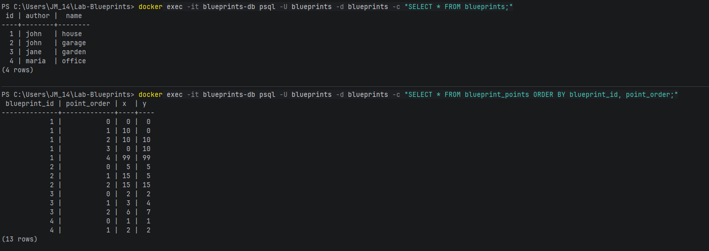

Estas insorciones se verificaron en la base de datos mediante consultas realizadas con los comandos

- docker exec -it blueprints-db psql -U blueprints -d blueprints -c "SELECT * FROM blueprints;"
- docker exec -it blueprints-db psql -U blueprints -d blueprints -c "SELECT * FROM blueprint_points ORDER BY blueprint_id, point_order;"

Pudiendo evidencidenciar la correcta insorcion del post y la modificacion del post

El Readme con la guia para inizializar la base de datos en docker se encuentra en la carpeta llamada
docker


#### Punto 5

Ya que identityFilter no tenia asignado un "profile" al intentar correr la aplicacion con algun pefil
esto hacia que explotara añadiendo la condicion que solo se active si uno de los 2 perfiles esta activo evitamos ese problema
"@Profile("!redundancy & !undersampling")"

una vez arreglado el conflicto de perfiles se hizo una insorcion en la base de datos 
con un curl de prueba

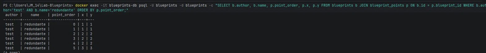

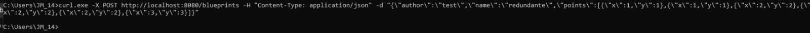

Luego inizalizamos la aplicacion con el pefil de redundancy usando el comando:

mvn spring-boot:run "-Dspring-boot.run.profiles=redundancy"

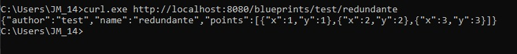

y con esto podemos observar que los puntos se devuelven sin repetidos consecutivos

Siguiendo el mismo proceso hicimos los mismo con undersampling

mvn spring-boot:run "-Dspring-boot.run.profiles=undersampling"

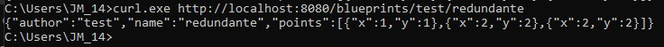

y podemos observar como borro la mitad de los puntos ya que eran 6 pero si un orden especifico


## 📊 Criterios de evaluación

| Criterio | Peso |
|----------|------|
| Diseño de API (versionamiento, DTOs, ApiResponse) | 25% |
| Migración a PostgreSQL (repositorio y persistencia correcta) | 25% |
| Uso correcto de códigos HTTP y control de errores | 20% |
| Documentación con OpenAPI/Swagger + README | 15% |
| Pruebas básicas (unitarias o de integración) | 15% |

**Bonus**:  

- Imagen de contenedor (`spring-boot:build-image`).  
- Métricas con Actuator.  