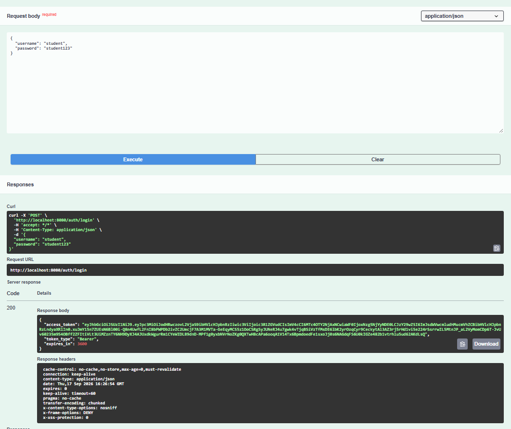
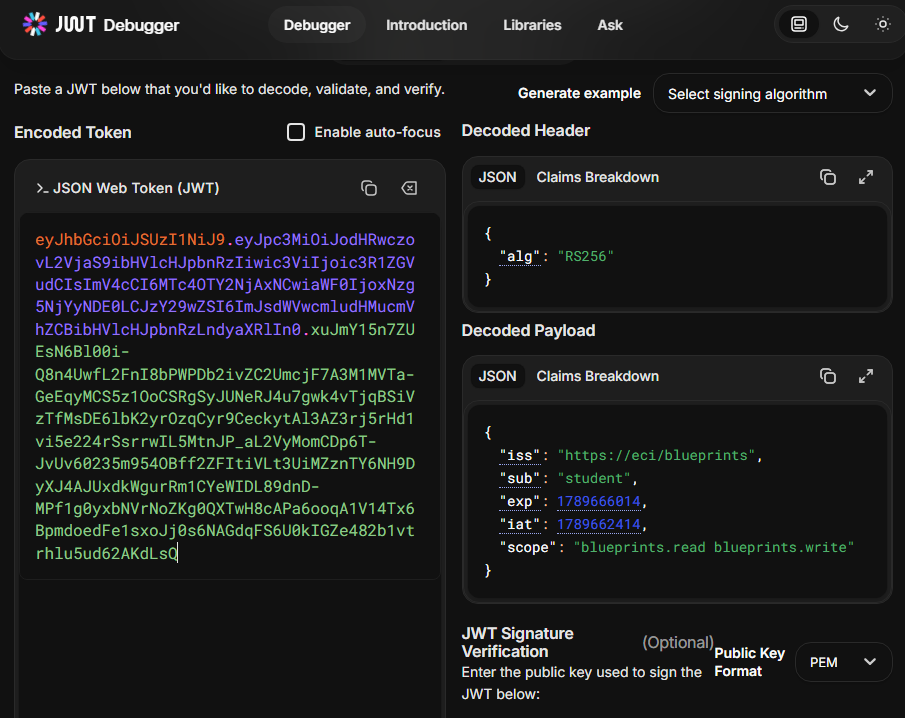
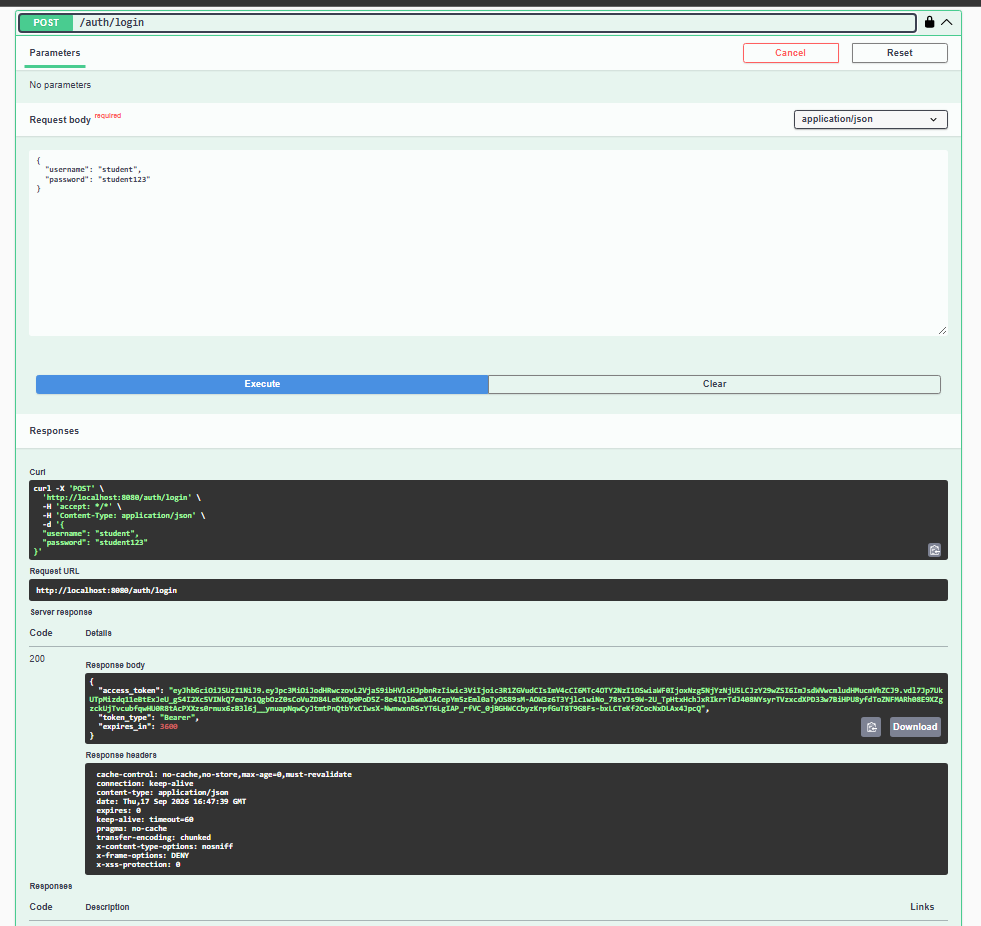
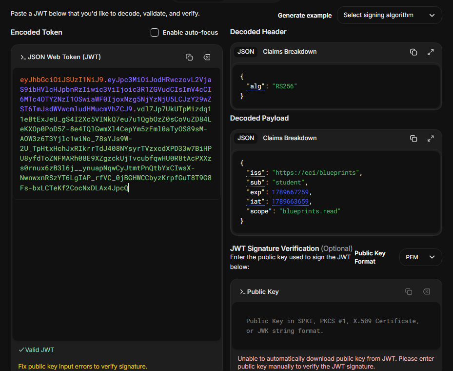
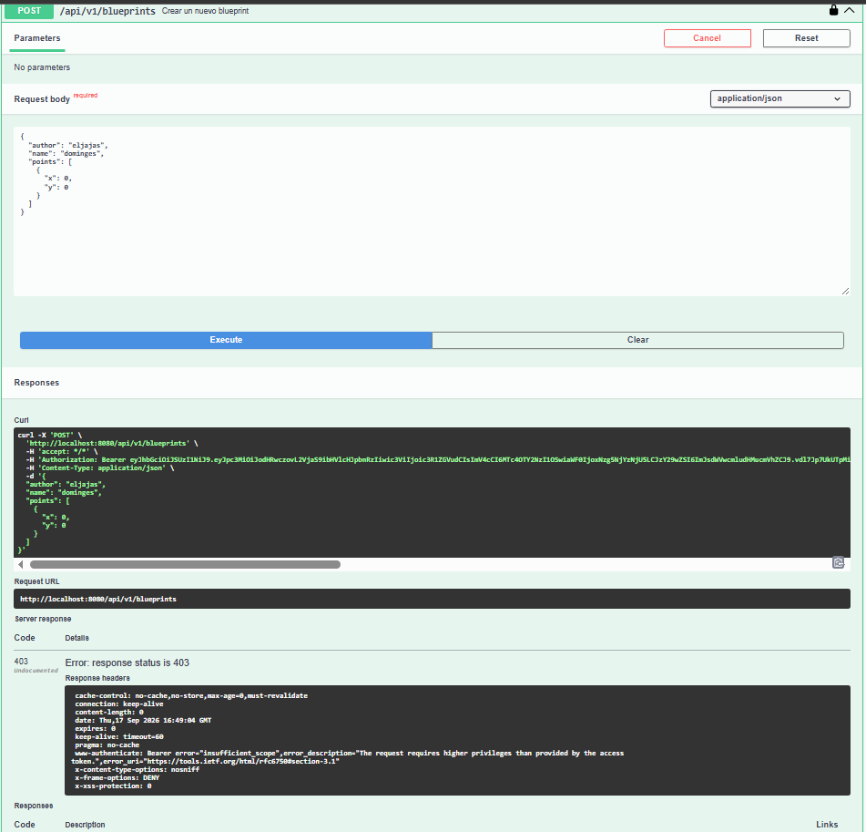
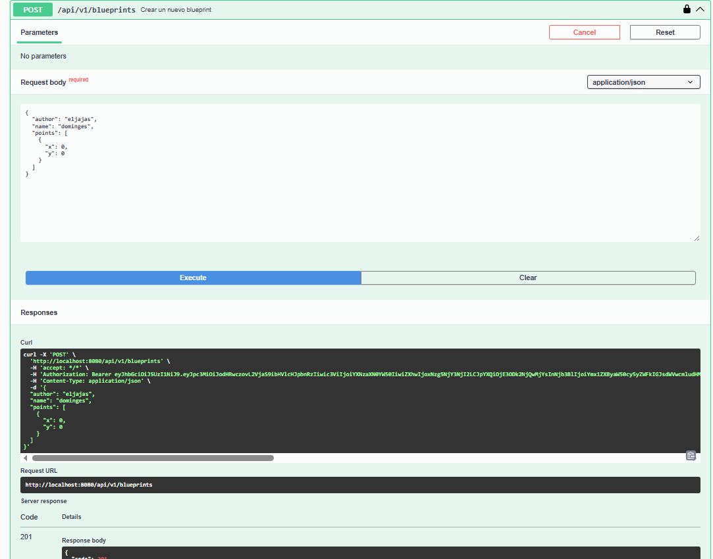

# Escuela Colombiana de Ingeniería Julio Garavito
## Arquitectura de Software – ARSW


### Juan Manuel López Barrera - Laura Valentina Santiago Marquez


### Laboratorio – Parte 2: BluePrints API con Seguridad JWT (OAuth 2.0)

Este laboratorio extiende la **Parte 1** ([Lab_P1_BluePrints_Java21_API](https://github.com/DECSIS-ECI/Lab_P1_BluePrints_Java21_API)) agregando **seguridad a la API** usando **Spring Boot 3, Java 21 y JWT (OAuth 2.0)**.  
El API se convierte en un **Resource Server** protegido por tokens Bearer firmados con **RS256**.  
Incluye un endpoint didáctico `/auth/login` que emite el token para facilitar las pruebas.

---

## Objetivos
- Implementar seguridad en servicios REST usando **OAuth2 Resource Server**.
- Configurar emisión y validación de **JWT**.
- Proteger endpoints con **roles y scopes** (`blueprints.read`, `blueprints.write`).
- Integrar la documentación de seguridad en **Swagger/OpenAPI**.

---

## Requisitos
- JDK 21
- Maven 3.9+
- Git

---

## Ejecución del proyecto
1. Clonar o descomprimir el proyecto:
   ```bash
   git clone https://github.com/DECSIS-ECI/Lab_P2_BluePrints_Java21_API_Security_JWT.git
   cd Lab_P2_BluePrints_Java21_API_Security_JWT
   ```
   ó si el profesor entrega el `.zip`, descomprimirlo y entrar en la carpeta.

2. Ejecutar con Maven:
   ```bash
   mvn -q -DskipTests spring-boot:run
   ```

3. Verificar que la aplicación levante en `http://localhost:8080`.

---

## Endpoints principales

### 1. Login (emite token)
```
POST http://localhost:8080/auth/login
Content-Type: application/json

{
  "username": "student",
  "password": "student123"
}
```
Respuesta:
```json
{
  "access_token": "eyJhbGciOiJSUzI1NiIsInR5cCI6IkpXVCJ9...",
  "token_type": "Bearer",
  "expires_in": 3600
}
```

### 2. Consultar blueprints (requiere scope `blueprints.read`)
```
GET http://localhost:8080/api/blueprints
Authorization: Bearer <ACCESS_TOKEN>
```

### 3. Crear blueprint (requiere scope `blueprints.write`)
```
POST http://localhost:8080/api/blueprints
Authorization: Bearer <ACCESS_TOKEN>
Content-Type: application/json

{
  "name": "Nuevo Plano"
}
```

---

## Swagger UI
- URL: [http://localhost:8080/swagger-ui/index.html](http://localhost:8080/swagger-ui/index.html)
- Pulsa **Authorize**, ingresa el token en el formato:
  ```
  Bearer eyJhbGciOi...
  ```

---

## Estructura del proyecto
```
src/main/java/co/edu/eci/blueprints/
  ├── api/BlueprintController.java       # Endpoints protegidos
  ├── auth/AuthController.java           # Login didáctico para emitir tokens
  ├── config/OpenApiConfig.java          # Configuración Swagger + JWT
  └── security/
       ├── SecurityConfig.java
       ├── MethodSecurityConfig.java
       ├── JwtKeyProvider.java
       ├── InMemoryUserService.java
       └── RsaKeyProperties.java
src/main/resources/
  └── application.yml
```

---

## Actividades propuestas
1. Revisar el código de configuración de seguridad (`SecurityConfig`) e identificar cómo se definen los endpoints públicos y protegidos.

- El authorizeHttpRequest es el encargado dententro de Spring Security de evaluar, para
cada request que llega contra que regla hace mach, en este caso los enpoinds publicos se definen bajo
"permitAll()" que en este caso es el actuator del estado de salud del contenedor y auth para logearse,
adiccionalmente tambien queda abierta la documentacion de la api


- para las rutas protegidas tenemos "hasAnyAuthority()" que en este caos exige que el token
tenga almenos alguno de los 2 scopes definidos, "anyRequest(9.Authenticated()" es la regla por defecto
para cualquier otra ruta que no tenga match con las anteriores.


2. Explorar el flujo de login y analizar las claims del JWT emitido.

- 
El logging se realiza mediante el endpoint de auth con los parametros de username y password, una vez
se valida que ambos sean correctos se dispensara un token jwt como se muestra en la imagen con su respectivo
tiempo de expiracion


- 
Decodificando el token mediante JWT.io podemos ver que su firmado es de tipo RSA "RS256"
que se genera en memoria por el JwtKeyProvider en el payload el emisor iss es el configurado en
el aplication.yml, tambien podemos ver el usuario autentificado "student", el iat/exp emision y expiracion
y el scope, en este caso el usuario recibe ambos scopes en un solo loggin
cosa que se modificara en el punto 3.


3. Extender los scopes (`blueprints.read`, `blueprints.write`) para controlar otros endpoints de la API, del laboratorio P1 trabajado.


- para extender los scope se modifico AuthController para que el scope embebido en el JWT
dependa del usuario que hace login, en lugar de que siempre tenga los 2 scopes,
student solo recibe el scope de read mientras qeu el assitant recive ambos,
para poder definir quien podia usar que enpoint en base a sus scopes se agrego la etiqueta de
@PreAuthorize con SCOPE_blueprints.read a los metodos getAll,byAuthor y byAuthorAndName, por otra parte se agrego con
SCOPE_blueprints.write a los enpoints de add y addPoint, asi el se valida si se tiene el scope adecuado a continuacion se veran
ejemplo en base al tipo de usuario:





El estudiante inicia sesion con la nueva modificacion de scope y al revisar su JWT en JWT.io podemos observar como ahora solo tiene
el scope de "read" lo que no le permite realizar acciones de adiccion o modificacion por ende solo puede usar los metodos
de consulta "get"



En esta imagen el estudiante intenta agregar un blueprint y vemos como le suelta un error HTTP 403
con la leyenda de "scope inadecuado" confirmando que no puede usar este tipo de accion



por ultimo cambiamos el JWT al de un Assistant y intentamos realizar la misma accion para ver como
esta vez si da un 201 Denotando que se creo con exito.


4. Modificar el tiempo de expiración del token y observar el efecto.
5. Documentar en Swagger los endpoints de autenticación y de negocio.

---

## Lecturas recomendadas
- [Spring Security Reference – OAuth2 Resource Server](https://docs.spring.io/spring-security/reference/servlet/oauth2/resource-server/index.html)
- [Spring Boot – Securing Web Applications](https://spring.io/guides/gs/securing-web/)
- [JSON Web Tokens – jwt.io](https://jwt.io/introduction)

---

## Licencia
Proyecto educativo con fines académicos – Escuela Colombiana de Ingeniería Julio Garavito.
